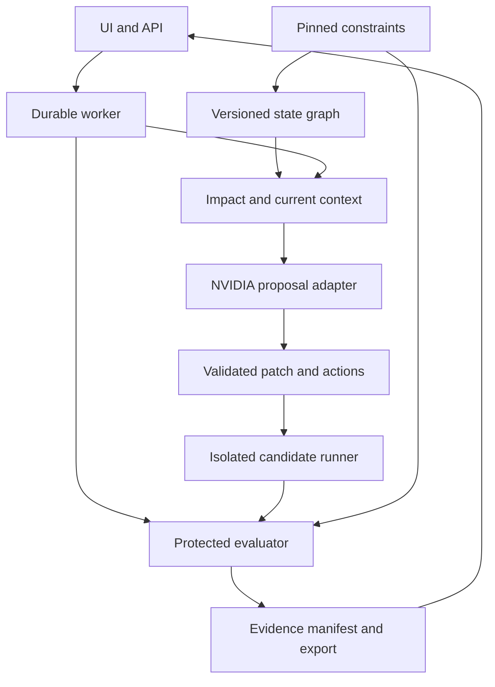

# System architecture

The revised architecture implements assurance around agent work. It is a bounded Python service implementation, not a whole IDE or a general distributed engineering platform.

## Components

| Component | Responsibility | Authoritative output |
| --- | --- | --- |
| React UI | Curated task, constraint review, impact, diff, verdict, export | User request only; never acceptance authority |
| FastAPI API | Session ownership, schemas, quotas, run creation and event access | Validated request and audit ID |
| Durable worker | Leases, state transitions, budgets, adapter calls, reconciliation | Versioned event/trajectory records |
| Constraint registry | Pin human-approved intent/check mapping | Contract hash and required-check IDs |
| State builder | AST plus explicit links, decision dependencies, source hashes | Typed graph snapshot and coverage issues |
| Impact/context service | Affected symbols/checks, risk reasons, freshness filtering | Source-bound context packet |
| NVIDIA adapter | Validated proposals and repair diffs | Proposal record plus provider metadata |
| Isolated candidate runner | Execute approved baseline/probe/candidate templates | Captured outputs, exits, runner IDs |
| Trusted evaluator | Expected values, protected oracle checks, final gate | Check results and verdict |
| Evidence service | Hash manifest, readable report, safe export | Immutable bundle and replay record |

Use single-instance SQLite with WAL where the chosen host supports it, a durable artifact directory, and one worker initially. Graph adjacency tables/JSON are enough; Neo4j, vector storage and a workflow framework are not prerequisites.

## Trust and data flow

The worker sends only allowlisted context to the model. The evaluator retains hidden expected values/check logic outside the candidate runtime. It sends bounded inputs through a protected launch/transport template and calculates results from outputs in the trusted zone. Candidate execution cannot write verdict storage. Network isolation is verified against the selected backend.

## State transitions

Normal path: QUEUED → PREPARING → ANALYZING → INVESTIGATING → PATCH_READY → VERIFYING → COMPLETED. A clean or definitively rejected no-repair path can complete directly with explicit NOT_RUN/REJECTED gate fields.

At repeated no-progress fingerprints, enter STALLED. P0 stops with preserved evidence; P1 permits one recovery to ANALYZING with a new, source-current context packet and a recorded strategy change. A second stall completes BLOCKED. FAILED, CANCELLED and TIMED_OUT terminate active work; incomplete checks never pass.

Use conditional state writes, worker lease and heartbeat, monotonically increasing event sequence, and persistent action reservations. On restart, mark unreconciled remote operations interrupted/pending; do not replay them blindly. An owner resume creates a linked attempt with explicit budget and provenance.

## Immutable identifiers

| Identifier | Binds |
| --- | --- |
| Source root/hash | Approved file manifest and contents |
| Contract hash | Accepted human intent, required checks and scope |
| Graph hash | Builder version, source, declared edges and coverage report |
| Context hash | Current source/contract, selected nodes, active decisions and exclusions |
| Patch hash | Base source hash plus normalized diff |
| Environment digest | Trusted dependency image and runner policy version |
| Evaluator hash | Protected check/oracle implementation |
| Evidence manifest hash | Run results and selected immutable artifacts |

Changing a relevant hash invalidates reuse. A source checkpoint is a filesystem/provisioning convenience, not a guarantee of full deterministic machine state.

After validating a diff, compute the candidate source hash and rebuild its affected graph/check selection. Do not rely on the original graph to claim coverage after a new call/import is introduced. Keep the accepted constraint set unchanged, retain base-to-candidate provenance, and expose any new unresolved dependency before final acceptance.

## Engineering graph and risk

Store File, Symbol, Contract, Test, Decision, Run and Patch nodes. Distinguish observed imports/definitions from declared contract/test links and inferred calls. Resolve direct calls conservatively; dynamic imports, reflection and unresolved dispatch become coverage issues. Traverse reverse dependencies from changed nodes within the approved manifest. Select affected tests plus mandatory global contracts.

Risk is a deterministic ordinal with listed triggers, such as a public schema change, monetary helper touching two callers, untested critical constraint, stale decision, or unknown dynamic edge. It is not a probability of failure. Missing critical mapping blocks acceptance or requires a newly approved narrower scope; it never silently drops a check.

## Independent verification and mutations

Prepare a fresh candidate environment from the pinned image and source plus approved diff. Run the accepted checks with expectations outside it. A model can propose adversarial examples but cannot own their oracle. P1 mutation templates are trusted, pre-authored semantic variants applied in separate fresh runs to assess whether checks detect defined regressions. Restore the candidate after each mutant; a mutant never becomes the shipped repair.

Baseline, probes, final checks and mutants all consume audit limits. End with a result even when only partial evidence exists. A VERIFIED result can be emitted only by the trusted deterministic gate for the accepted required-check set.

An execution counter counts each actual remote candidate process/command invocation. One approved bounded batch may exercise multiple input assertions through the protected transport, with expected results computed outside candidate execution; each newly started process still counts. Batch scheduling cannot reset the 60-second process limit or 300-second audit deadline, and omitted required assertions remain UNKNOWN.
